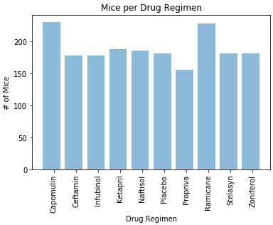
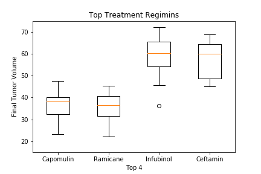
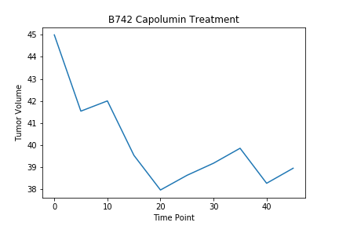
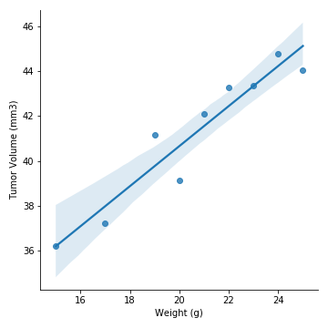

# Cancer-Pharmaceutical-Treatment-Analysis
### Tech Stack
* Python
* Jupyter Notebook
* MatPlotLib
- - -
### User Instructions
* Clone the repository: git clone https://github.com/Vincent-glitch/Cancer-Pharmaceutical-Treatment-Analysis.git
* Open [Pharmaceutical_Analysis](notebooks/Pharmaceutical_Analysis.ipynb) and run the cells top down.
- - -
# Background
Screening for potential treatments for squamous cell carcinoma (SCC), a commonly occurring form of skin cancer.

In this study, 249 mice identified with SCC tumor growth were treated through a variety of drug regimens. Over the course of 45 days, tumor development was observed and measured. The purpose of this study was to compare the performance of Pymaceuticals' drug of interest, Capomulin, versus the other treatment regimens. 
- - -

* Cleaned data 

* Generated a summary statistics table consisting of the mean, median, variance, standard deviation, and SEM of the tumor volume for each drug regimen.

* Calculated the final tumor volume of each mouse across four of the most promising treatment regimens: Capomulin, Ramicane, Infubinol, and Ceftamin. 

* Generated a plot that shows the number of total mice for each treatment regimen throughout the course of the study.

    
    
* Calculated the quartiles and IQR and quantitatively determine if there are any potential outliers across all four treatment regimens.
* Generated a box and whisker plot of the final tumor volume for all four treatment regimens.

    

* Selects a mouse that was treated with Capomulin and generate a line plot of time point versus tumor volume for that mouse.

    

* Calculated the correlation coefficient and linear regression model between mouse weight and average tumor volume for the Capomulin treatment. Plot the linear regression model on top of the previous scatter plot.

    
    
